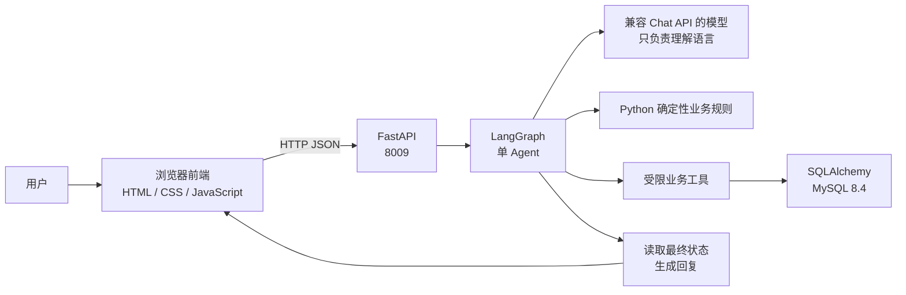

# ServiceFlow

ServiceFlow 是一个面向模拟电商售后的单 Agent 工作流。用户用自然语言描述订单问题，系统提取意图、查询订单、匹配确定性业务规则，并通过受限业务工具更新 MySQL 中的模拟状态。

它适合用来学习和展示一条完整的 Agent 业务闭环：

```text
自然语言请求 → 结构化意图 → Python 业务规则 → 受限工具 → 数据库事实 → 可核验回复
```

## 项目能做什么

- 查询模拟订单和处理进度；
- 取消尚未发货的订单；
- 处理小额退款；
- 对高金额退款创建人工审批并支持 LangGraph 中断/恢复；
- 为换货、维修或信息不足的请求创建工单或继续追问；
- 通过固定案例和数据库最终状态评估 Agent 是否真的完成了业务。

项目中的用户、订单、金额、政策和处理结果全部是自建模拟数据，不连接真实商城、支付、物流或客户系统。

## 运行时架构



模型不能直接修改订单，也不能直接拼接 SQL。模型只输出结构化意图；是否合法、调用什么工具以及数据库最终状态，都由 Python 业务规则、应用服务和数据库共同约束。

## 三个最直观的例子

| 用户输入 | 预期路径 | 最终结果 |
| --- | --- | --- |
| `ORDER-001 还没发货，帮我取消` | 查询订单 → 取消工具 | 订单变为 `cancelled` |
| `ORDER-007 的耳机有问题，我想退款` | 查询订单 → 小额退款工具 | 订单变为 `refunded`，退款完成 |
| `ORDER-003 的耳机有质量问题，我想退款` | 查询订单 → 创建审批 → 人工同意 → 退款 | 审批通过，退款完成，订单变为 `refunded` |

信息不完整时，Agent 应先询问缺少的订单号或业务诉求，不应凭空猜测订单，也不应在没有明确业务依据时修改数据库。

## 技术栈

- Python 3.12、FastAPI、Pydantic、Uvicorn；
- LangGraph 单 Agent 工作流；
- SQLAlchemy 2、MySQL 8.4，SQLite 用于快速隔离测试；
- 原生 HTML、CSS、JavaScript 前端；
- Docker Compose 编排 FastAPI 和 MySQL；
- pytest、Ruff 和固定 JSONL 案例评测。

## 快速启动

### 1. 准备环境变量

复制示例文件为本机配置文件，并在 `.env` 中填写模型配置。`.env` 已被忽略，不会进入 Git：

```powershell
Copy-Item .env.example .env
```

### 2. 启动后端和 MySQL

```powershell
docker compose build
docker compose up -d
Invoke-RestMethod http://127.0.0.1:8009/api/v1/health
Invoke-RestMethod -Method Post http://127.0.0.1:8009/api/v1/demo/reset
```

### 3. 启动前端

前端是静态文件，单独在本机启动：

```powershell
python -m http.server 5173 --bind 127.0.0.1 --directory frontend
```

浏览器打开 <http://127.0.0.1:5173/>。

端口关系如下：

```text
浏览器前端 127.0.0.1:5173
        ↓ HTTP JSON
FastAPI   127.0.0.1:8009
        ↓ Docker 内部网络
MySQL     宿主机 127.0.0.1:33069 / 容器内 mysql:3306
```

### 4. 停止服务

```powershell
docker compose down
```

`docker compose down` 会停止并删除容器，但默认保留 MySQL 数据卷。只有确认要清空模拟数据库时，才使用 `docker compose down -v`。

## 测试与评测

软件测试不需要真实模型网络，使用 Fake Model 和 SQLite：

```powershell
Set-Location backend
uv run pytest -q
uv run ruff check .
uv run ruff format --check .
```

固定案例位于 [`tests/eval_cases`](tests/eval_cases)，包含核心案例和复杂中文案例。真实模型评测需要本机 `.env` 中存在模型配置，结果默认写入被 Git 忽略的 `outputs/evaluation/`，不把运行时元数据和历史报告作为公开仓库内容。

## 目录结构

```text
ServiceFlow/
├─ backend/
│  ├─ src/serviceflow/
│  │  ├─ domain/          # 订单、状态和业务规则
│  │  ├─ application/     # 业务用例与副作用边界
│  │  ├─ infrastructure/  # SQLAlchemy、数据库和种子数据
│  │  ├─ agent/           # LangGraph、模型适配和提示词
│  │  ├─ api/             # FastAPI HTTP JSON 接口
│  │  └─ evaluation/      # 固定案例评测
│  └─ tests/              # 单元、集成、API 与 Agent 测试
├─ frontend/              # 原生浏览器前端
├─ tests/eval_cases/      # 冻结的模拟业务案例
├─ docs/public/           # 可公开的架构和开发说明
├─ compose.yaml           # FastAPI + MySQL
└─ LICENSE                # MIT License
```

## 设计边界

这是一个学生作品集和工程学习项目，不是生产客服系统。V1 不包含真实支付、真实客户数据、登录鉴权、权限系统、生产风控、高可用、消息队列、多 Agent、向量数据库或复杂 RAG。新增能力应先有明确业务需求和可验证案例，再进入实现。

更多公开说明：

- [公开架构说明](docs/public/ARCHITECTURE.md)
- [本地开发与运行](docs/public/DEVELOPMENT.md)
- [评测说明](docs/public/EVALUATION.md)

## License

[MIT License](LICENSE)
