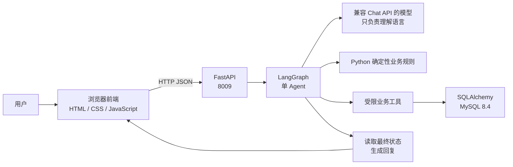

# ServiceFlow

[](https://github.com/GGBond121211/ServiceFlow/actions/workflows/ci.yml)

> 当前主线是 **ServiceFlow 2.0 baseline**：一个面向模拟电商售后的、可运行的单 Agent 业务流程展示项目。
> 2.0 优先完成可运行闭环、工程验证和部署演示；质量参数的重型 A/B 实验延期到 2.1+，不把参考默认值描述成最优结论。

ServiceFlow 是一个面向模拟电商售后的单 Agent 工作流。用户用自然语言描述订单问题，系统提取意图、查询订单、匹配确定性业务规则，并通过受限业务工具更新 MySQL 中的模拟状态。

## 2.0 做了什么

2.0 在保留“模型理解语言、Python 政策做业务约束、数据库终态做事实来源”这一核心边界的基础上，补齐了一条可观测、可恢复、可部署的 Agent 工程闭环：

- **Tool Loop + MCP**：模型可以在受限工具注册表中选择工具；Tool Executor 仍负责风险、确认和审批门禁，模型不能直接写数据库或拼接 SQL；
- **业务状态与恢复**：Session、Case、Operation、Run、SQL checkpoint、租户/资源授权、确认/审批、幂等、UNKNOWN 对账、Webhook/Outbox 和 Redis/Celery Worker；
- **Policy RAG**：BM25、语义检索、Qdrant/HNSW、RRF 和候选重排组成政策检索链，政策层级与来源边界单独记录；
- **LLM Gateway**：统一模型路由、能力过滤、有界重试/fallback、deadline、熔断、限流和低基数运行指标；
- **可观测与部署**：OpenTelemetry → Collector → Jaeger、Prometheus、Grafana、双 Gateway 故障切换、Docker Compose 和本地 Kubernetes manifest；
- **CI/CD**：Push/PR 自动运行代码检查、测试、确定性评测清单和容器构建；推送 `v*.*.*` 标签时构建并发布不可变 GHCR 镜像，CD 也提供不推送镜像的手动 dry-run。

2.0 是面向学习、作品集和面试演示的本地模拟系统，不连接真实商城、支付、物流或客服系统。Compose 观测栈和 Kubernetes manifest 是可复现演示能力

一条完整的 Agent 业务闭环：

```text
自然语言请求 → 结构化意图 → Python 业务规则 → 受限工具 → 数据库事实 → 可核验回复
```

## 项目能做什么

- 查询模拟订单和处理进度；
- 取消尚未发货的订单；
- 处理小额退款；
- 对高金额退款创建人工审批并支持 LangGraph 中断/恢复；
- 为换货、维修或信息不足的请求创建工单或继续追问；
- 通过固定案例和数据库最终状态评估 Agent 是否真的完成了业务。

项目中的用户、订单、金额、政策和处理结果全部是自建模拟数据，不连接真实商城、支付、物流或客户系统。

## 运行时架构



模型不能直接修改订单，也不能直接拼接 SQL。模型只输出结构化意图；是否合法、调用什么工具以及数据库最终状态，都由 Python 业务规则、应用服务和数据库共同约束。

2.0 增加了 Native Tool Loop + MCP 路径，使 ToolResult 可以影响模型的下一步选择；旧的固定图路径保留为兼容路径。无论走哪条路径，政策、授权、确认/审批、幂等和最终数据库状态检查都不交给模型决定。

## 三个最直观的例子

| 用户输入 | 预期路径 | 最终结果 |
| --- | --- | --- |
| `ORDER-001 还没发货，帮我取消` | 查询订单 → 取消工具 | 订单变为 `cancelled` |
| `ORDER-007 的耳机有问题，我想退款` | 查询订单 → 小额退款工具 | 订单变为 `refunded`，退款完成 |
| `ORDER-003 的耳机有质量问题，我想退款` | 查询订单 → 创建审批 → 人工同意 → 退款 | 审批通过，退款完成，订单变为 `refunded` |

信息不完整时，Agent 应先询问缺少的订单号或业务诉求，不应凭空猜测订单，也不应在没有明确业务依据时修改数据库。

## 技术栈

- Python 3.12、FastAPI、Pydantic、Uvicorn；
- LangGraph 单 Agent 工作流；
- SQLAlchemy 2、MySQL 8.4，SQLite 用于快速隔离测试；
- 原生 HTML、CSS、JavaScript 前端；
- Docker Compose 编排 API、双 LLM Gateway、Worker、MySQL、Redis、Qdrant、OTel Collector、Jaeger、Prometheus 和 Grafana；
- pytest、Ruff 和固定 JSONL 案例评测。

## 快速启动

### 1. 准备环境变量

复制示例文件为本机配置文件，并在 `.env` 中填写模型配置。`.env` 已被忽略，不会进入 Git：

```powershell
Copy-Item .env.example .env
```

`SERVICEFLOW_THINKING_MODE` 和 `SERVICEFLOW_REASONING_EFFORT` 控制 DeepSeek 的思考模式。
项目默认使用 `enabled + high` 保持复杂中文意图质量；如果只追求简单意图的低延迟，可以在
明确做过业务正确率回归后改为 `disabled`。

### 2. 启动后端和 MySQL

```powershell
docker compose build
docker compose up -d
Invoke-RestMethod http://127.0.0.1:8009/api/v1/health
Invoke-RestMethod -Method Post http://127.0.0.1:8009/api/v1/demo/reset
```

第十步本地交付还提供 Linux/WSL2 入口：

```bash
./ops/scripts/deploy.sh
./ops/scripts/healthcheck.sh http://127.0.0.1:8009/api/v1/health 120
```

启动后可访问 Jaeger <http://127.0.0.1:16686>、Prometheus <http://127.0.0.1:9090> 和 Grafana
<http://127.0.0.1:3000>。这些是本地演示组件，不是生产观测后端。

### 3. 启动前端

前端是静态文件，单独在本机启动：

```powershell
python -m http.server 5173 --bind 127.0.0.1 --directory frontend
```

浏览器打开 <http://127.0.0.1:5173/>。

端口关系如下：

```text
浏览器前端 127.0.0.1:5173
        ↓ HTTP JSON
FastAPI   127.0.0.1:8009
        ↓ Docker 内部网络
MySQL     宿主机 127.0.0.1:33069 / 容器内 mysql:3306
```

### 4. 停止服务

```powershell
docker compose down
```

`docker compose down` 会停止并删除容器，但默认保留 MySQL 数据卷。只有确认要清空模拟数据库时，才使用 `docker compose down -v`。

## 测试与评测

### CI/CD

每次 Push 或 Pull Request 会触发 GitHub Actions：

- `quality-and-tests`：安装锁定依赖、运行 `ruff check`、Python compile smoke，以及单元/API/集成/契约测试；
- `eval-smoke`：生成不调用真实模型的确定性评测清单并上传 artifact；
- `docker-and-compose`：校验 Compose 配置并构建应用镜像。

正式 CD 只由版本标签触发：

```text
v2.0.0  →  GitHub Actions  →  ghcr.io/ggbond121211/serviceflow:v2.0.0
```

可以手动运行同一个 release workflow 做 dry-run；它只构建镜像，不推送 GHCR。真实模型评测是单独的手动 workflow，需要明确配置 GitHub Environment Secrets，不会被普通 CI 或 CD 自动触发。

软件测试不需要真实模型网络，使用 Fake Model 和 SQLite：

```powershell
Set-Location backend
uv run python -m pytest -q --basetemp=../work/pytest-readme
uv run ruff check .
```

`ruff format` 不作为当前门禁。V1 已按 `v1.0.0` / `v1.0.1` 冻结，格式器版本差异会改变冻结文件；代码检查以 `ruff check` 为准。

异步全链路压力测试使用核心 40 案和复杂中文 60 案，共 100 个案例。它使用确定性的
异步回放模型，不消耗外部模型额度；100 个逻辑用户共享同一个 FastAPI、LangGraph、
异步 SQLAlchemy 会话工厂和数据库：

```powershell
uv run serviceflow async-stress
```

默认测试并发档位为 1、10、25、50、100。只测试指定档位时可以写成：

```powershell
uv run serviceflow async-stress --level 10 100
```

报告写入 `outputs/evaluation/serviceflow-async-pressure.json` 和
`outputs/evaluation/serviceflow-async-pressure.md`。这个压力测试用于验证异步链路、
数据库并发和 HTTP 业务结果；它不等价于真实模型语义质量评测，真实模型评测仍使用
`serviceflow eval`。

如果要按真实运行链路测试 Docker、MySQL 和 DeepSeek，可以运行下面的命令。这个命令
会产生真实模型调用费用，并且会把每个案例映射到独立的临时用户和订单；测试结束后只
清理本轮临时数据，不清理原有演示数据：

```powershell
Set-Location backend
uv run python -m serviceflow.evaluation.real_stress `
  --level 1 10 50 100 `
  --output-stem serviceflow-real-deepseek-100
```

如果需要测试 300 个并发用户，可以把同一组 100 个案例重复 3 次：

```powershell
uv run python -m serviceflow.evaluation.real_stress `
  --repeat 3 --level 300 `
  --output-stem serviceflow-real-deepseek-300
```

真实压测要求 Docker Compose 已启动、根目录 `.env` 中存在模型配置，并且 API 容器能够
访问 DeepSeek。报告会同时记录业务通过率、HTTP/传输错误、吞吐量、P50/P95/P99 延迟、
模型名称和失败案例，输出到 `outputs/evaluation/`。

数据库查询优化使用独立的真实 MySQL 基准，避免把大模型响应时间混入 SQL 结论：

```powershell
uv run python -m serviceflow.evaluation.database_benchmark `
  --history-rows 2000 `
  --noise-order-count 100 `
  --noise-rows-per-order 180
```

它会在同一批临时 MySQL 数据上对比旧单列索引查询和新联合索引加 `LIMIT 1` 查询，记录
`EXPLAIN`、实际返回行数、平均耗时和 P95；测试完成后自动清理临时记录。

真实压力测试报告还会读取 API 的 `Server-Timing`，分别统计模型调用、LangGraph、数据库
连接、SQL、业务规则、响应组装和 HTTP 往返耗时。若要把模型耗时继续拆成响应头、首 Token
和首 Token 后生成，可以在 API 容器内运行流式探针：

```powershell
docker compose exec -T api python -m serviceflow.evaluation.model_latency `
  --iterations 5 --concurrency 1 --output /tmp
docker compose cp api:/tmp/serviceflow-model-latency.json `
  ./outputs/evaluation/serviceflow-model-latency.json
docker compose cp api:/tmp/serviceflow-model-latency.md `
  ./outputs/evaluation/serviceflow-model-latency.md
```

固定案例位于 [`tests/eval_cases`](tests/eval_cases)，包含核心案例和复杂中文案例。真实模型评测需要本机 `.env` 中存在模型配置，结果默认写入被 Git 忽略的 `outputs/evaluation/`，不把运行时元数据和历史报告作为公开仓库内容。

## 目录结构

```text
ServiceFlow/
├─ backend/
│  ├─ src/serviceflow/
│  │  ├─ domain/          # 订单、状态和业务规则
│  │  ├─ application/     # 业务用例与副作用边界
│  │  ├─ infrastructure/  # SQLAlchemy、数据库和种子数据
│  │  ├─ agent/           # LangGraph、模型适配和提示词
│  │  ├─ api/             # FastAPI HTTP JSON 接口
│  │  └─ evaluation/      # 固定案例评测
│  └─ tests/              # 单元、集成、API 与 Agent 测试
├─ frontend/              # 原生浏览器前端
├─ tests/eval_cases/      # 冻结的模拟业务案例
├─ docs/public/           # 可公开的架构和开发说明
├─ ops/                   # Collector、Prometheus、Grafana 和 Linux 运维脚本
├─ deploy/k8s/            # kind/Minikube 本地 Kubernetes manifest
├─ compose.yaml           # 2.0 本地服务编排
└─ LICENSE                # MIT License
```


更多公开说明：

- [公开架构说明](docs/public/ARCHITECTURE.md)
- [本地开发与运行](docs/public/DEVELOPMENT.md)
- [评测说明](docs/public/EVALUATION.md)
- [部署说明](docs/public/DEPLOYMENT.md)
- [运维 Runbook](docs/public/OPERATIONS.md)


## License

[MIT License](LICENSE)
