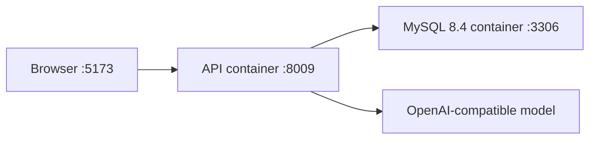

# ServiceFlow V1 架构

> 本文描述 2026-08-11 已完成并验证的 V1 结构。最终完成状态与命令证据见 `docs/STATUS.md`。

## 1. 架构原则

1. 使用模块化单体，不拆微服务。
2. 一个 LangGraph Agent 足够完成 V1。
3. LLM 负责语言理解和结构化意图；当前图使用确定性模板生成回复，确定性代码同时负责业务规则、数据库写入和结果判定。
4. Agent 只能调用显式业务工具，不直接访问 SQLAlchemy Session。
5. 先在 SQLite 上学习和运行快速测试，最终演示使用 MySQL。
6. 前端只通过 HTTP JSON API 调用后端。
7. Docker Compose 最终只编排 `api` 和 `mysql` 两个服务。

## 2. 已实现组件

```text
Browser UI
    |
    | HTTP JSON
    v
FastAPI routes
    |
    v
LangGraph service agent
    |-- intent extraction (LLM)
    |-- deterministic policy decision
    |-- tool selection and execution
    |-- approval interruption/resume
    `-- response composition (deterministic template)
            |
            v
Business tools
    |-- get_order
    |-- cancel_order
    |-- request_refund
    |-- create_ticket
    |-- create_approval
    `-- get_case_status
            |
            v
SQLAlchemy repositories
            |
            v
SQLite in fast tests / MySQL in integration and demo
```

## 3. 已实现目录

```text
Project-0009-ServiceFlow/
├─ AGENTS.md
├─ README.md
├─ compose.yaml
├─ backend/
│  ├─ pyproject.toml
│  ├─ uv.lock
│  ├─ Dockerfile
│  ├─ src/serviceflow/
│  │  ├─ __init__.py
│  │  ├─ cli.py
│  │  ├─ config.py
│  │  ├─ domain/
│  │  │  ├─ models.py
│  │  │  ├─ policies.py
│  │  │  └─ results.py
│  │  ├─ application/
│  │  │  ├─ order_service.py
│  │  │  ├─ case_service.py
│  │  │  ├─ results.py
│  │  ├─ infrastructure/
│  │  │  ├─ database.py
│  │  │  ├─ tables.py
│  │  │  ├─ repositories.py
│  │  │  ├─ case_repository.py
│  │  │  └─ seed.py
│  │  ├─ agent/
│  │  │  ├─ state.py
│  │  │  ├─ model.py
│  │  │  ├─ intent.py
│  │  │  ├─ tools.py
│  │  │  ├─ graph.py
│  │  │  └─ prompts/
│  │  │     └─ service_agent_v1.txt
│  │  ├─ api/
│  │  │  ├─ app.py
│  │  │  ├─ dependencies.py
│  │  │  ├─ schemas.py
│  │  │  └─ routes.py
│  │  └─ evaluation/
│  │     ├─ models.py
│  │     ├─ loader.py
│  │     ├─ runner.py
│  │     └─ report.py
│  └─ tests/
│     ├─ unit/
│     ├─ integration/
│     ├─ api/
│     ├─ agent/
│     ├─ evals/
│     └─ fixtures/
├─ frontend/
│  ├─ index.html
│  ├─ app.js
│  └─ styles.css
├─ docs/
├─ tests/
│  └─ eval_cases/
│     └─ serviceflow_v1.jsonl
├─ work/
└─ outputs/
   └─ evaluation/
```

目录按实际职责创建；V1 没有空的未来接口、工厂或兼容层。

## 3.1 源码组织硬规则

- `src/serviceflow/` 按业务职责分层，稳定层级为 `domain`、`application`、`infrastructure`、`agent`、`api` 和 `evaluation`；不得把项目主要实现堆入根级 `app.py`、`main.py` 或单个通用模块。
- 每个模块只负责一种可以清楚命名的职责。领域数据放 `domain/models.py`，领域处理结果放 `domain/results.py`，确定性政策放 `domain/policies.py`；应用服务、数据库、Agent、API 和评测代码进入各自目录。
- 跨层依赖保持单向：领域层不依赖 FastAPI、SQLAlchemy、LangGraph 或模型 SDK；应用层组合领域与仓储；基础设施实现持久化；Agent 和 API 只通过应用服务触发业务行为。
- `__init__.py` 保持轻量，只做包标识或必要的稳定导出，不在其中编写业务流程。
- 测试按职责放入 `tests/unit`、`tests/integration`、`tests/api`、`tests/agent` 和 `tests/evals`，并尽量与被验证模块对应。
- 不使用固定行数作为拆分指标；当文件混合两个以上独立职责、出现大段无关导入，或一次修改需要阅读大量无关代码时，按领域概念或用例拆成多个模块。
- 分层不等于预建抽象。只有当前 Task 出现真实代码时才创建目录和文件，不为未来功能创建空接口、工厂、适配器或兼容层。

## 4. 业务与 Agent 分层

### Domain

保存订单、退款、工单、审批等纯业务对象和政策判断，不依赖 FastAPI、SQLAlchemy、LangGraph 或模型 SDK。

### Application

组合领域规则和仓储操作，提供 `cancel_order`、`request_refund`、`create_ticket` 等清楚用例。Agent 工具调用这一层，不直接操作 ORM。

### Infrastructure

保存 SQLAlchemy 表、Session、仓储实现和确定性种子数据。SQLite 与 MySQL 共享同一业务接口，但不为未来数据库创建复杂适配器体系。

### Agent

保存 LangGraph 状态、模型调用、工具包装、Prompt 和图编排。状态只记录可审查字段，不保存模型隐藏推理。

### API

把应用用例和 Agent 会话暴露为 HTTP JSON，不包含业务判断。

### Evaluation

重置案例数据、运行 Agent、读取最终状态并生成 JSON/Markdown 报告。

## 5. LangGraph 状态

当前状态包含：

```text
thread_id
user_id
user_message
order_id
issue_type
requested_action
missing_fields
order_snapshot
policy_id
decision
tool_events
approval_id
case_id
final_business_state
assistant_message
error
model_name
prompt_version
token_usage
```

V1 不增加长期记忆服务。当前已选方案是 LangGraph `InMemorySaver`：它保存同一进程内的 thread checkpoint 和审批中断位置；订单、退款、工单与审批状态继续由 MySQL 保存。V1 不承诺 API 重启后恢复未完成对话，也不再增加第二套会话数据库或 Redis。

## 6. 图节点

```text
START
  -> extract_intent
  -> route_missing_info ---- missing/error -> compose_response -> END
  -> load_order
       `-- not found -> compose_response -> END
  -> evaluate_policy
  -> execute_action
       | cancel
       | direct_refund
       | approval_required -> create pending approval
       | create_ticket
       ` explain_only
  -> read_final_state
       `-- pending approval -> wait_for_approval -> interrupt
                                `-- Command(resume) -> read_final_state
  -> compose_response
  -> END
```

业务规则判断节点必须是确定性 Python 代码。模型不能自行决定订单状态转移是否合法。

## 7. 数据库与会话状态

MySQL/SQLite 已实现持久化表：

- `users`
- `orders`
- `order_items`
- `refunds`
- `tickets`
- `approvals`

`conversations` 和 `tool_events` 没有建成数据库表。V1 会话索引、LangGraph checkpoint 和工具轨迹保存在当前 API 进程内；订单、退款、工单与审批才是 MySQL 业务事实。API 重启后不恢复会话，但数据库业务状态保留。

数据库创建采用 SQLAlchemy metadata；V1 没有第二版 schema，因此未引入 Alembic。

## 8. 模型边界

- 使用 OpenAI-compatible Chat Completions/Responses 适配方式，与具体供应商解耦到一个小模块。
- 模型运行配置固定使用 `SERVICEFLOW_API_KEY`、`SERVICEFLOW_BASE_URL` 和 `SERVICEFLOW_MODEL`；密钥不得写入仓库。
- API Key 只通过环境变量传入，不写入仓库。
- 软件测试使用 Fake Model，不调用网络。
- 只有真实 Agent 评测使用配置的模型。
- 第一个运行 Prompt 出现时才创建 `service_agent_v1.txt`；后续行为变化使用新文件，不覆盖旧版本。

## 9. Docker Compose 部署

最终服务只有：

```text
mysql:    mysql:8.4
api:      backend/Dockerfile
```

API 镜像基于固定 `python:3.12.13-slim`，通过锁定的 `uv==0.11.32` 和 `uv.lock` 安装运行依赖。Compose 内 API 使用服务名 `mysql:3306`，宿主机暴露 API `8009` 和数据库 `33069`；根目录 `outputs/evaluation` 以只读方式挂载到 API，用于浏览器打开真实评测报告。



前端是静态文件，开发和演示时使用 Python 静态服务器，不增加 Node 构建链或 Nginx 容器。

## 10. 已验证的架构证据

- LangGraph 使用真实条件边、`interrupt()` 和同一 thread 的 `Command(resume=...)`；
- API 提供创建会话、消息、查询轨迹和审批决定四条会话接口；
- 浏览器三条流程均经过 HTTP API，前端不导入后端源码；
- Compose 中 MySQL 与 API 同时运行，最终审批退款状态由 MySQL 查询确认；
- 100 案 runner 按核心40案与复杂中文60案分区运行，从数据库重新读取终态并生成总体与难度分区报告。
