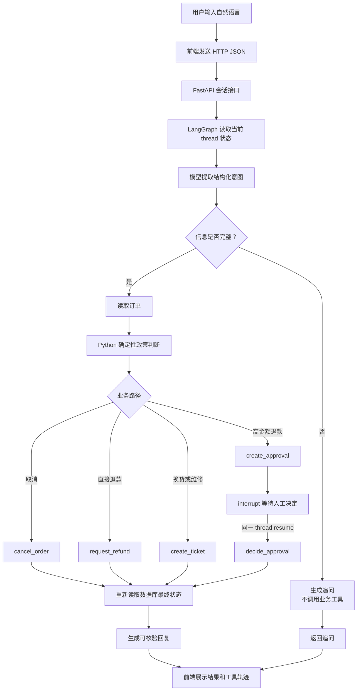
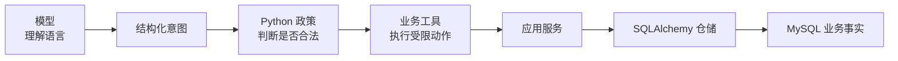

# ServiceFlow 公开架构说明

## 1. 一次请求如何流转



## 2. 分层职责

| 层 | 负责什么 | 不负责什么 |
| --- | --- | --- |
| `domain` | 订单状态、退款期限、金额审批等确定性规则 | HTTP、数据库和模型调用 |
| `application` | 组合业务用例，统一管理副作用边界 | 解释自然语言 |
| `infrastructure` | SQLAlchemy 表、Session、仓储和种子数据 | 决定用户意图 |
| `agent` | LangGraph 状态、模型适配、工具包装和图编排 | 直接拼接 SQL |
| `api` | 对外提供 HTTP JSON 接口 | 把业务规则写进路由 |
| `evaluation` | 重置案例、运行请求、读取终态和计算指标 | 修改期望答案迎合模型 |

## 3. Agent 状态

状态保存可审查的业务字段，例如：

```text
thread_id / user_id / user_message
order_id / issue_type / requested_action
order_snapshot / policy_id / decision
missing_fields / tool_events / approval_id / case_id
final_business_state / assistant_message / error
model_name / prompt_version / token_usage
```

状态不保存模型隐藏推理。LangGraph 的进程内 checkpoint 负责同一进程内的中断恢复；订单、退款、工单和审批状态以 MySQL 为业务事实来源。

当前实验分支将运行链路改为异步：FastAPI 路由使用 `async def`，图调用使用
`ainvoke` / `aget_state`，模型适配器使用异步 Chat API，数据库使用 SQLAlchemy
`AsyncSession`，Compose 中的 MySQL 驱动为 `aiomysql`，SQLite 测试驱动为 `aiosqlite`。
只做日期、状态和政策判断的纯 Python 函数仍保持普通同步函数，因为它们没有等待外部
I/O 的必要。

## 4. 模型与数据库的边界



因此，“模型说已经退款”不等于退款成功。只有工具调用成功、应用服务完成写入，并从数据库重新读取到预期状态，系统才会向用户返回完成结论。

## 5. 服务边界

Compose 只包含两个后端服务：

- `api`：FastAPI 和 LangGraph，宿主机端口 `8009`；
- `mysql`：MySQL 8.4，宿主机端口 `33069`。

前端是静态 HTML/CSS/JavaScript 文件，开发时由本机 Python 静态服务器提供，默认端口 `5173`，不与后端源码互相导入。
