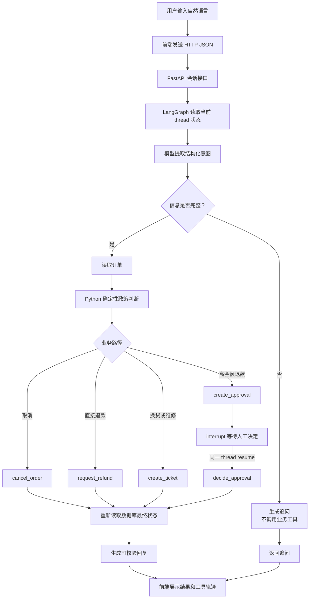
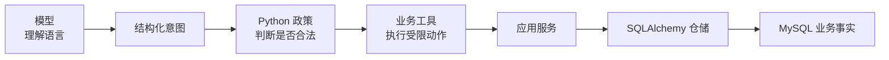

# ServiceFlow 公开架构说明

> **版本标注（2026-09-05，2.0.1）**
>
> §1 固定流程图是 **V1 历史基线**，冻结于 `v1.0.1`（commit `c7d61fd`）；§0 与服务说明描述当前实现，不要把两条路径混用。
>
> 下表区分 V1 历史路径和当前 2.0 实现：
>
> | 位置 | 历史 V1 | 当前 2.0 实现 |
> |---|---|---|
> | §1 流程图 | 固定分支拓扑：代码决定工具 | **已实现** Native Tool Loop + MCP；政策和权限仍由代码门禁 |
> | §3 状态 | LangGraph **进程内** checkpoint | **已实现** SQL checkpoint 与 SQL Session，API 重启可恢复 |
> | §5 服务边界 | Compose 只有 `api` 和 `mysql` | **已有** API、MySQL、Redis、Qdrant、Celery Worker、双 LLM Gateway + Nginx 与本地 OpenTelemetry Trace |
>
> **不变量**：模型可以提议工具但不决定业务合法性、副作用只经应用服务、终态以数据库为准、高风险动作需人工确认或审批。

## 0. 当前 2.0 已实现补充

Native Tool Loop 可以依据 ToolResult 选择下一步，但每次工具执行都经过显式租户和资源 ACL。所有写工具要求用户确认，高金额退款还要服务端审批；确认绑定用户、租户、参数摘要和有效期。政策证据不足、Provider UNKNOWN 或系统无法可靠回答时，会写入持久 `support_queue` 并追加审计事件，而不是让模型猜测。

2.0.1 的 Web 主路径直接调用 CaseService 写模拟业务表；下述 Provider/Operation/Outbox 是独立组件契约，尚未接入 Web 退款执行。Native 只接入最近 8 条历史和政策证据正文，完整 Memory/ContextAssembler/Prompt Release 尚未贯通。自定义 MCP-style stdio 用于受信内部组件，不承诺标准 MCP 互操作。

API 的用户/审批角色由可伪造的演示请求头选择，不是认证。确认使用数据库唯一 claim 阻止同一 pending action 的重复领取；它只是 at-most-once attempt，不是跨业务事务/checkpoint 的 exactly-once。领取后崩溃需人工核对；同一会话不支持多写者同时推进。

副作用 Provider 链路使用稳定幂等键、参数指纹、数据库唯一约束和行锁；Provider timeout 且结果未知时进入 `UNKNOWN`，只允许 query、Webhook 或人工对账推进。ProviderEventInbox 去重回调，业务状态与 Outbox 同事务提交；Celery + Redis Worker 投递 Outbox，SQL TaskEnvelope 保存 lease、deadline、重试和人工/死信结果。当前 Provider 全为 Fake，Celery 实际承载的是 Outbox，周期 reconcile 尚未接入。

`step8.1-v1` LLM Gateway 按场景路由 DeepSeek V4 Flash 与 GPT-5.6 Luna，按真实 tenant 限流并记录模型 attempt、Token、Frontier ◆ 成本、延迟和业务/Trace 标识。宿主机 Gateway 只监听 `127.0.0.1:8010`，模型与内部观测接口均要求服务 Bearer 密钥。运行时 Metrics 当前是每副本内存聚合；Streaming 未实现，`stream=true` 明确返回 422。

这些能力使用模拟用户、订单和审批主体，只证明本地工程契约，不代表企业 IAM、真实客服队列或生产资金安全。

## 1. V1 一次请求如何流转



## 2. 分层职责

| 层 | 负责什么 | 不负责什么 |
| --- | --- | --- |
| `domain` | 订单状态、退款期限、金额审批等确定性规则 | HTTP、数据库和模型调用 |
| `application` | 组合业务用例，统一管理副作用边界 | 解释自然语言 |
| `infrastructure` | SQLAlchemy 表、Session、仓储和种子数据 | 决定用户意图 |
| `agent` | LangGraph 状态、模型适配、工具包装和图编排 | 直接拼接 SQL |
| `api` | 对外提供 HTTP JSON 接口 | 把业务规则写进路由 |
| `evaluation` | 重置案例、运行请求、读取终态和计算指标 | 修改期望答案迎合模型 |

## 3. Agent 状态

状态保存可审查的业务字段，例如：

```text
thread_id / user_id / user_message
order_id / issue_type / requested_action
order_snapshot / policy_id / decision
missing_fields / tool_events / approval_id / case_id
final_business_state / assistant_message / error
model_name / prompt_version / token_usage
```

状态不保存模型隐藏推理。V1 使用进程内 checkpoint；2.0 API 已切换到 SQL checkpoint 和 SQL Session。无论哪一版，checkpoint 只负责恢复上下文，订单、退款、工单、审批、Operation 和 Handoff 状态仍以数据库为业务事实来源。

当前主线运行链路是异步：FastAPI 路由使用 `async def`，图调用使用
`ainvoke` / `aget_state`，模型适配器使用异步 Chat API，数据库使用 SQLAlchemy
`AsyncSession`，Compose 中的 MySQL 驱动为 `aiomysql`，SQLite 测试驱动为 `aiosqlite`。
只做日期、状态和政策判断的纯 Python 函数仍保持普通同步函数，因为它们没有等待外部
I/O 的必要。

## 4. 模型与数据库的边界



因此，“模型说已经退款”不等于退款成功。结构化终态回读数据库；V1 使用确定性回复，Native 的自然语言仍由模型生成，不保证完全没有幻觉，验收必须核对工具结果和数据库事实。

## 5. 服务边界

V1 Compose 只有 `api` 和 `mysql`。当前 2.0 本地 Compose 包含：

- `api`：FastAPI 和 LangGraph，宿主机端口 `8009`；
- `mysql`：MySQL 8.4，宿主机端口 `33069`。
- `redis`：会话 Memory 的 cache-aside 演示，不是业务事实源；
- `qdrant`：Policy RAG 的 HNSW 向量检索，异常时只影响证据检索路径。
- `worker`：Celery 5.6 + Redis broker，当前投递 SQL Outbox；以非 root 用户运行。
- `gateway-a` / `gateway-b`：两个本地无状态 LLM Gateway 副本；共享 Redis、MySQL 和 Frontier 故障域；
- `gateway-proxy`：Nginx 本地反向代理，仅映射到宿主机回环地址 `127.0.0.1:8010`；
- `otel-collector` / `jaeger`：本地 OTLP Trace 接收和 UI；
- `prometheus` / `grafana`：本地低基数指标存储和面板。

OpenTelemetry 仅在测试中显式使用内存 exporter；Compose 使用 OTLP HTTP exporter，经 Collector 导出到 Jaeger，不再额外累积 Span 副本。指标由 API、两个 Gateway 和 Worker 暴露给 Prometheus。Collector/Jaeger/Prometheus/Grafana 是本地演示组件，不代表生产持久化、容量或 HA；尾部采样仍未实现。SSE/Streaming 尚未实现。

前端是静态 HTML/CSS/JavaScript 文件，开发时由本机 Python 静态服务器提供，默认端口 `5173`，不与后端源码互相导入。
